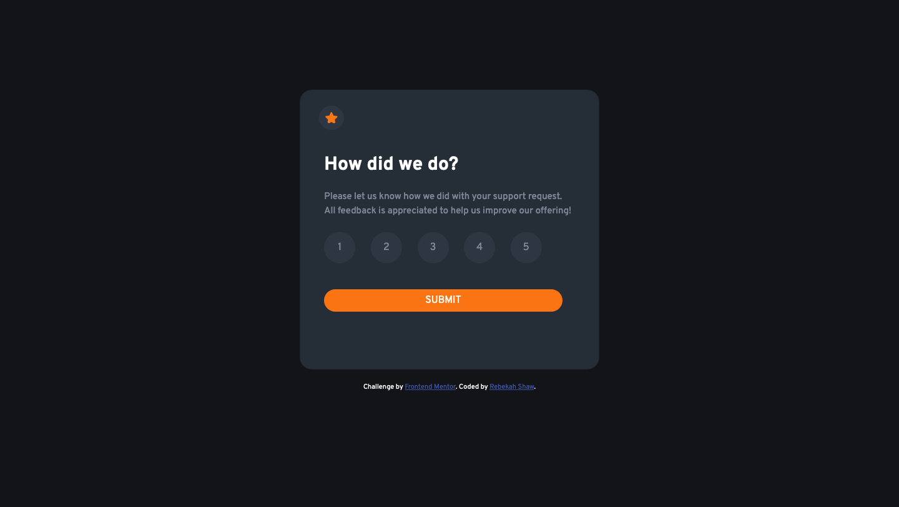
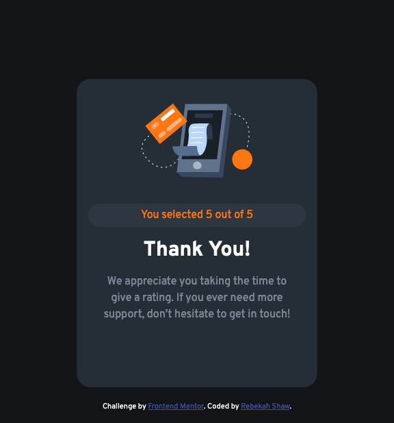

# Frontend Mentor - Interactive rating component solution

## Table of contents

- [Overview](#overview)
  - [The challenge](#the-challenge)
  - [Screenshot](#screenshot)
  - [Links](#links)
- [My process](#my-process)
  - [Built with](#built-with)
  - [What I learned](#what-i-learned)
  - [Continued development](#continued-development)
  - [Useful resources](#useful-resources)
- [Author](#author)

## Overview

### The challenge

Users should be able to:

- View the optimal layout for the app depending on their device's screen size
- See hover states for all interactive elements on the page
- Select and submit a number rating
- See the "Thank you" card state after submitting a rating

### Screenshot

#### Desktop

#### Mobile

### Links

- Solution URL: [ Solution](https://github.com/rebekahshaw92//interactive-rating-component)
- Live Site URL: [Live Site](https://rebekahshaw92.github.io/interactive-rating-component)

### Built with

- Semantic HTML5 markup
- CSS custom properties
- Sass
- Bootstrap 5
- JavaScript
- Mobile-first workflow

### What I Learned  

While undertaking this project I worked with button and learned how to get a value from them within javaScript and display it within the text element.

### Continued Development

I wanted to continued to work with JavaScript and learn all that I can do with buttons and forms. 

### Userful Resources 

- [Bootstrap]https://getbootstrap.com) - This site helped me learn all I needed to know about Bootstrap.

## Author

- Website - [Rebekah Shaw](https://www.rebekahshaw.com)
- Frontend Mentor - [@rebekahshaw92](https://www.frontendmentor.io/profile/rebekahshaw92)
- Twitter - [@x_beckyboo_x](https://www.twitter.com/x_beckyboo_x)

